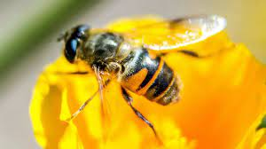

 
You will find here the material I use for my **Latent Variables Models for ecology and biology** Class  in [Master 2  *Mathématiques pour les Sciences du Vivant*](https://sites.google.com/view/m2-msv/) of [University Paris Saclay](https://www.universite-paris-saclay.fr/en/education/master/mathematics-and-applications/m2-mathematiques-pour-les-sciences-du-vivant). 

 </img>

 

**Slides of the course**

  * **Chap 1** : Introduction [<i class="fa fa-download"></i>](LatentVariablesModels/chap1_LVM_Intro.pdf)
  * **Chap 2** : mixture models [<i class="fa fa-download"></i>](LatentVariablesModels/chap2_LVM_Mixtures.pdf)
  * **ZI-Poisson TP**:  Data [<i class="fa fa-download"></i>](LatentVariablesModels/BarentsFish.csv) and instructions [<i class="fa fa-download"></i>](LatentVariablesModels/TP_ZIP.pdf) 
  * **Chap 3** : Hidden Markov Models  [<i class="fa fa-download"></i>](LatentVariablesModels/chap3_LVM_HMM.pdf)
  * **Chap 4** : Stochastic Block Models [<i class="fa fa-download"></i>](LatentVariablesModels/chap4_LVM_SBM_LBM.pdf). This class will be completed by a  [tutorial](LatentVariablesModels/TutorialBM.html) on R. 
  
   
  * **Chap5** : A gentle introduction to Variational probabilistic Autoencoder  [<i class="fa fa-download"></i>](LatentVariablesModels/chap5_LVM_VAE.pdf)     </img> 
  
  
  * **Chap 6** : Bayesien inference of Latent variable models. 
       - Slides are here [<i class="fa fa-download"></i>](LatentVariablesModels/chap5_LVM_bayesian_main.pdf). 
       - Some R code examples are given [here](bayesian_stat.html).  
       - *In particular*, we will study the difference between *Variational inference and MCMC* on the [Poisson Mixture model](BayesianClassMaterial/PoissonMixtureVBversusMCMC.html). The codes are [here](BayesianClassMaterial/PoissonMixtureVB.zip). 

   
 

**Practical organization**
    
In 2025, the class will take place at **AgroParisTech, 22 place de l'Agronomie, Palaiseau** in room Pal-C2.1.33, on wednesdays from 14:00 to 17:00

 </img>

  * 08/01/2025
  * 15/01/2025
  * 22/01/2025
  * 29/01/2025 
  * 12/02/2025 
  * 19/02/2025
  * 05/03/2025

 

**Evaluation**

The evaluation consists in a 3 hours exam  the 19th of March 2025.  [Exam of 2024](LatentVariablesModels/examen_2024.pdf) 
 

