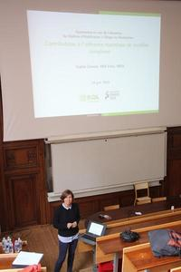

 

 </img>

**Since jan. 2023 ** :  Senior Researcher (DR2) at [INRAE](www.inrae.fr),  [MIA Paris-Saclay](https://mia-ps.inrae.fr/)

**Since jan. 2022** :  Vice head (DUA) of [MIA Paris Saclay](https://mia-ps.inrae.fr/). 

**Since jan. 2021** : Team Leader of [SOLsTIS](https://mia-ps.inrae.fr/solstis)

Member of the scientific councils of [AgroParisTech](http://www2.agroparistech.fr/Structure-Fonctionnement-5.html) and the [MathNUM  INRAE departement](https://www.inrae.fr/en/divisions/mathnum)

Correspondant for scientific mediation actions at [FMJH](https://www.fondation-hadamard.fr/en)

Responsible of the Ecology "parcours"  at [Master 2 MathSV](https://sites.google.com/view/m2-msv/programme/semestre-2?authuser=0),  University Paris Saclay

[Detailed CV in French (2025)   <i class="far fa-file"></i>](CVDonnet_2025.pdf)

 

## Previous positions

- 2013-2022:  Researcher (CR) at [INRAE](www.inrae.fr),  [MIA Paris-Saclay](https://mia-ps.inrae.fr/)

- 2012-2014 : Long time mission in Mexico, as a visiting researcher at [CIMAT](https://www.cimat.mx) (Centro de Investigacion en Matematicas) and [Instituto de Matematicas, Universidad Nacional Autonoma de México (UNAM)](https://www.matem.unam.mx/).  

- 2007 - 2013 : Lecturer (Maître de conférences) at   [Université Paris-Dauphine](https://dauphine.psl.eu). Membre du [CEREMADE](https://www.ceremade.dauphine.fr)

 

## University curriculum 

  
- 2018 : Habilitation à Diriger les Recherches (**HDR**)  **Contributions à l’inférence statistique de modèles complexes** [<i class="fa fa-download"></i>](publi/HDR_Donnet.pdf) 

- 2003 - 2006 : **PhD in Statistics**. Defended on  30/11/2006 at University Paris-Sud. *Advisors* : [M. Lavielle](http://www.cmap.polytechnique.fr/~lavielle/)  et [J.-B. Poline](https://www.mcgill.ca/neuro/jean-baptiste-poline-phd) (INRIA-Neuropsin). *Title* : **Inversion de données IRMf. Estimation et sélection de modèles**. 

 - 2002 - 2003 : Master 2 in Stochastic modeling and statistics at  University Paris Sud.
 
 - 2001 - 2002 : **Agrégation de mathématiques**, option probabilités et statistique. 

 