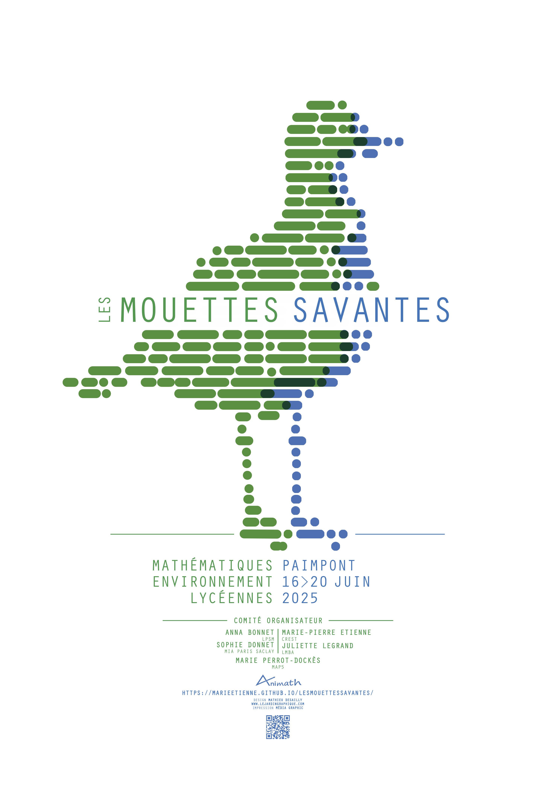

 
  

 </img>
 
  
I am a statistics researcher at  [INRAE](https://www.inrae.fr/) @ [MIA Paris Saclay](https://mia-ps.inrae.fr/).

Currently, I am

  * Vice head (DUA) of [MIA Paris Saclay](https://mia-ps.inrae.fr/). 
  * Head of the team [SOLsTIS](https://mia-ps.inrae.fr/solstis) (Statistical mOdelling and Learning for environnemenT and lIfe Sciences).  

Our lab is located at [Campus Agro Paris-Saclay](https://www.agroparistech.fr/lecole/ecole-8-sites/campus-agro-paris-saclay) in Palaiseau (Plateau de Saclay). 

 
  
## Research 

I am specialized in the development of **statistical learning methods for ecology and life sciences** in general.  More details [here](research.html). I work with [people from different backgrounds: statisticians, ecologists...](collaborators.html)

  
  
 
 

<!-- ## Job offers -->

<!--   - We are looking for a PhD candidate for a Cifre thesis at [EDF (Chatou)](https://www.edf.fr/groupe-edf/inventer-l-avenir-de-l-energie/r-d-un-savoir-faire-mondial/5-ans-edf-lab-saclay/edf-lab-chatou-75-ans-de-recherche) on [Hawkes processes](pdfFiles/HawkesEDS.pdf). Contact me if you are interested.   -->

<!--  - We also have a post-doc position available on [population genetics](pdfFiles/Post_doc_Proposal_AgroParisTech.pdf) with Camille Coron.  -->

   
 

## The next events:  

 <!-- -  Ecole chercheurs CESAB  [**Analyse de réseaux d’interactions en écologie**](https://www.fondationbiodiversite.fr/?post_type=evenement&p=23848) in Montpellier, 31th march to  4th april 2025 -->

 - Scientific bootcamp for high school girls  [**Les mouettes savantes**](https://marieetienne.github.io/lesmouettessavantes/),  June 2025

 </img>

 
    
## Contact information

- <i class="fas fa-map-marker"></i> 
Bureau E4.215, Bâtiment recherche E, Campus agronomique Paris-Saclay 

- <i class="fa-solid fa-envelope"></i> 
UMR MIA-Paris-Saclay, AgroParisTech, INRAE,  
  22 place de l’Agronomie,  
  91120 Palaiseau 
  

- <i class="fa fa-phone"></i> +33 (0)1 89 10 09 38

- <i class="fa fa-at"></i> <a href="mailto:sophie.donnet@inrae.fr
">sophie [dot] donnet  [at] inrae [dot] fr</a>

 
 

 

    
*Last update on `r format(Sys.time(), '%d/%m/%y')` *

   *Photo prise par Jean-Baptiste Denis à l'occasion de la journée en l'honneur de Eric Parent.*  
