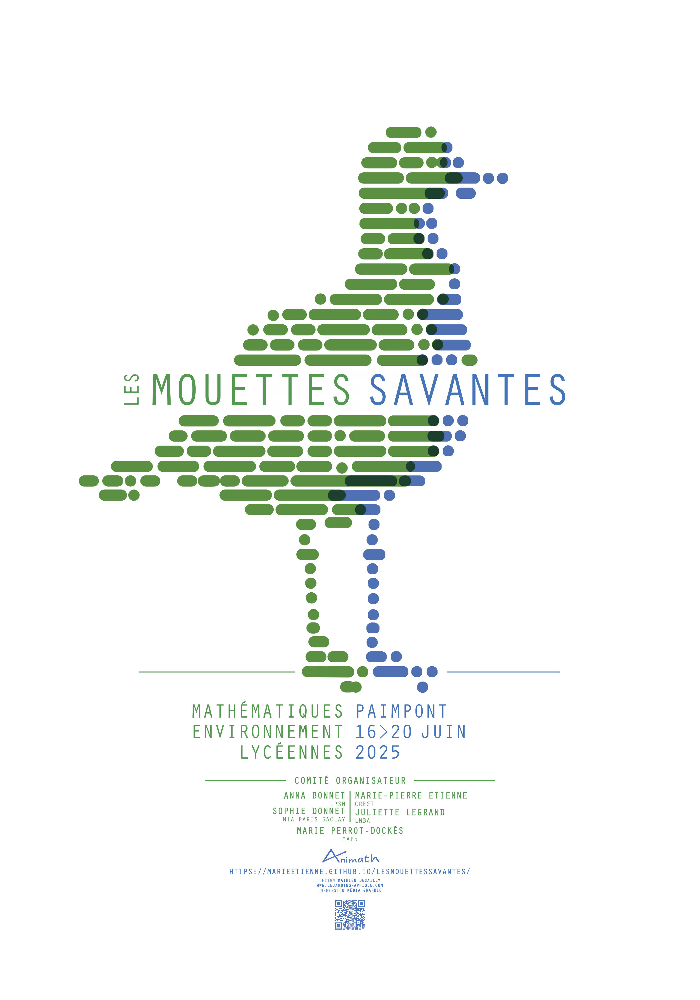

  

 </img>

Avec [Marie-Pierre Etienne](https://marieetienne.github.io/), [Anna Bonnet](https://annabonnet.github.io/), [Marie Perrot-Dockès](https://marie-perrotdockes.github.io/) et [Juliette Legrand](https://juliette_legrand.pages.math.cnrs.fr/), nous organisons une semaine de stage réservées aux lycéennes de 2nde.  Si vous souhaitez en savoir plus sur les [Mouettes Savantes](https://marieetienne.github.io/lesmouettessavantes/), vous pouvez regarder cette [vidéo](https://www.youtube.com/watch?v=tYjVIsT2Qmo) tournée lors de la première édition.  

Vous trouverez [ici](https://sophiedonnet.github.io/MoustiqueTigre/) les ressources nécéssaires au projet "Moustique Tigre" que j'encadrerai lors des Mouettes Savantes 2026. 

  

  