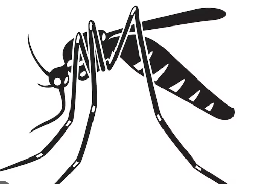

  

 </img>

Vous trouverez ici les ressources nécéssaires au projet "Moustique Tigre" des [Mouettes Savantes 2025](https://marieetienne.github.io/lesmouettessavantes/). 

  - [Cas de dengue, zika et chikungunya](DataMoustiqueTigre/arbovirose_data_year.csv) (données issues de santé public france).  
  - [Présence du moustique sur le territoire métropolitain par département](DataMoustiqueTigre/presenceMoustiqueTigre_data_year.csv)  
  - [Présence du moustique sur le territoire métropolitain au cours du temps](DataMoustiqueTigre/infectionMoustiqueTigre_data_year.csv)

  