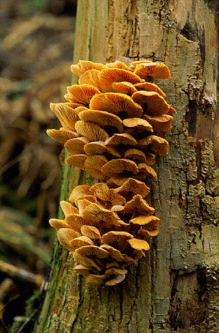

  

  

You will find here the material I use for my 3 hours  class on **probabilistic models for network analysis**. 

  

  

  
 </img>

  * Here are the slides of the course. [<i class="fa fa-download"></i>](Networks/slides_BlockModels.pdf)
  
  * The R-package I use is [`sbm`](https://cran.r-project.org/web/packages/sbm/index.html). **Please install it before the session**.  
  
  * The tuto (Rmd) is available here [<i class="fa fa-download"></i>](Networks/Tuto_sbm.zip)
  
  * For udpate see that [github repo](https://github.com/Sophiedonnet/IntroductionToBlockModels)
  

    
    