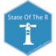
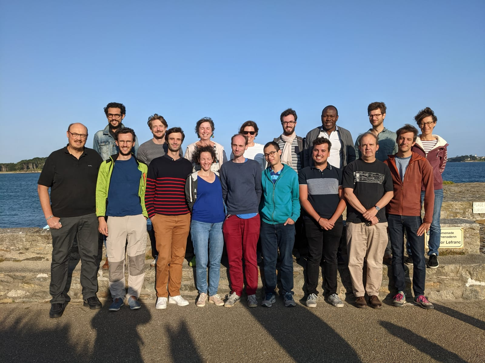

Currently I am involved in the following projects

- Projet ANR [Econet](https://cmatias.perso.math.cnrs.fr/ANR_EcoNet.html). 
  
- Projet ANR [NGB](https://anr.fr/Project-ANR-17-CE32-0011).

- Projet ANR [Pastodiv](https://anr.fr/Projet-ANR-19-CE32-0004) Pastoral practices and Domestic Animal Diversity. 
      
- GDR [Resodiv](https://resodiv.cnrs.fr/amp/le-gdr/direction/) 

 

## Methodological networks

I am also very proud to belong to the group [State Of The R](https://stateofther.github.io)  </img>

 </img>

 

## Organization of workshops 

I co-organize the following coming events. 
  
  - Workshop [**Statistiques au sommet de Rochebrune**](https://sophiedonnet.github.io/StatsAuSommetRochebrune/)
  
 -  Ecole chercheurs CESAB  [**Analyse de réseaux d’interactions en écologie**](https://www.fondationbiodiversite.fr/?post_type=evenement&p=23848) in Montpellier, 22 – 26 April 2024 
  
 - Scientific bootcamp for high school girls  [**Les mouettes savantes**](https://marieetienne.github.io/lesmouettessavantes/) organized with [Anna Bonnet](https://anna.biogeek.land/) and [Marie-Pierre Etienne](https://marieetienne.github.io/) in Paimpont, 24 - 28 June 2024

 
