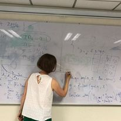

**Development of probabilistic models and statistical learning  methods for ecology and life sciences**.

 

 </img>

  

- Models for complex interaction network data: multi-level, multiplex, multipartite ...

-  Models defined by ordinary and stochastic differential equations.

- Bayesian statistics: elicitation of a priori distribution and combination of expert 

-  Bayesian parametric and nonparametric statistics for counting processes.
Statistical Inference for Gaussian Graphical Models

- Stochastic algorithms: MCMC, EM and stochastic versions, particule filters ...

- Applications in ecology: interaction networks pollinating plants, insects,

 </img>

  

- Other Application fields : neuroscience, pharmacokinetics, food risk, EDF reliability, social networks

## Projects

