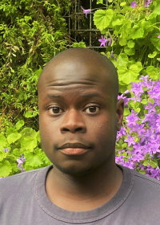
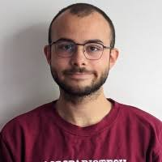

  

##  <i class="fa fa-graduation-cap"></i>  Current post-docs 

- Lucas Rey co encadré avec Camille Coron et Julien Stoehr

  

##  <i class="fa fa-graduation-cap"></i>  Current PhD students 

- {width=10%} [Ibrahim Seydi](https://www.linkedin.com/in/ibrahim-seydi-94b450201?originalSubdomain=fr). Since Mai. 2025,  with  Merlin Keller and [Julien Stoehr](https://www.ceremade.dauphine.fr/~stoehr/) (AgroParisTech). Fellowship : CIFFRE EDF  - Agroparistech innovation

  
 
- {width=10%} [Louis Lacoste](https://mia-ps.inrae.fr/louis-lacoste). Since Sept. 2024,  with [Pierre Barbillon](https://www6.inrae.fr/mia-paris/Equipes/Membres/Pierre-Barbillon) (AgroParisTech) and [Julie Aubert](https://julieaubert.github.io/myprowebsite/) (INRAE). Fellowship : [FMJH](https://www.universite-paris-saclay.fr/en/doctoral-schools/hadamard-doctoral-school-mathematics) and [Département MATHNUM](https://www.inrae.fr/departements/mathnum), INRAE.  

 
 
   
 
 - {width=10%} [Barbara Bricout](https://tourduvalat.org/staff/barbara-bricout/). Since February 2023,  with S. Robin (Sorbonne Université), Thomas Galewski ([Tour du Valat](https://tourduvalat.org/)), Pierre Defos Du Rau (OFB) and  Laura Dami ([Tour du Valat](https://tourduvalat.org/)). Fellowship: OFB, Tour du Valat

  
 
- {width=10%} [Benoit Pichon](https://isem-evolution.fr/membre/pichon/). Since Sept. 2022,   with [Sonia Kefi](https://isem-evolution.fr/membre/kefi/) (ISEM) and [Isabelle Gounand](https://isabellegounand.wordpress.com/) (iEES-Paris). Fellowship: [Chaire MMB](http://www.cmap.polytechnique.fr/chaire-mmb/)

   

##  <i class="fa fa-graduation-cap"></i>  Past    PhD students 

- {width=10%}[Tam Le Minh](https://tam-leminh.github.io/).Oct 2020 - 2023, with  S. Robin (Sorbonne Université) and  [F. Massol](https://spici.weebly.com/francois-massol.html) (CNRS). Fellowship :  [DIM Mathinnov](https://www.dim-mathinnov.fr/) and ANR Project [EcoNet](https://cmatias.perso.math.cnrs.fr/ANR_EcoNet.html)

- {width=10%} [Saint-Clair Chabert-Liddell](https://chabert-liddell.netlify.app/en/). Between sept. 2018 and march 2022, with [P. Barbillon](https://www6.inrae.fr/mia-paris/Equipes/Membres/Pierre-Barbillon) (AgroParisTech). Fellowship : [EDMH](https://www.universite-paris-saclay.fr/en/doctoral-schools/hadamard-doctoral-school-mathematics)

 
   
 
##  <i class="fa fa-graduation-cap"></i>  Past Post-doc  

   
   - Saint-Clair Chabert-Liddell (between 02/2023 and ) with [S. Mahevas](https://umr-marbec.fr/membre/stephanie-mahevas/) (IFREMER), [N. Bez](https://umr-marbec.fr/membre/nicolas-bez/) (IRD) et [P. Gloaguen](https://papayoun.github.io/) (Univ. Bretagne Sud). Fellowship: [France Filière Pêche (FFP) as part of the MACCOLOC project](https://www.francefilierepeche.fr/projets/maccoloc-analyse-indices-abondance-flottille/)
 
   
   - Andreia Hisi (betwenn 04/2020 and 04/2021) with S. Robin (INRAE). Fellowship [ANR NGB](https://anr.fr/Projet-ANR-17-CE32-0011)

   
 
## <i class="fa fa-book"></i>  Master 2 

 - Louis Lacoste (2024)
 
 - Armand Favrot (2021)
 
 - Ferdinand Campos (2021)

 - Tâm Le Minh (2020) 
 
 - Souhila Founas (2019)

 - Saint-Clair Chabert-Liddell (2018) 
 
 - Daouda Ba (2018) 
   
 - Timothée Tabouy (2016) 
   
 - Abdel Wahab Sow (2015) 
   
 - Marco Banterle (2012)
 
   
 
## <i class="fa fa-book"></i>  Master 1  
 Antoine Malet (2024), Thomas Vrignaud (2019), Jocelyn Vanhonacker (2018), Wei Huang (2010)
