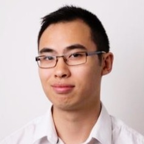
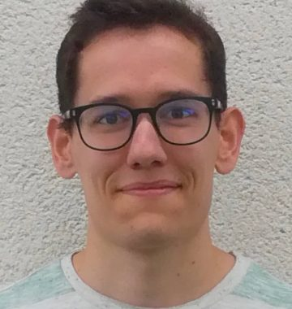
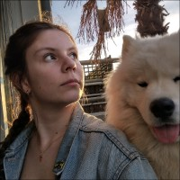
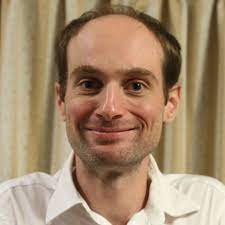

  

  

##  <i class="fa fa-graduation-cap"></i>  PhD students 

 
### Current 

{width=10%}[Tam Le Minh](https://tam-leminh.github.io/). Since oct. 2020, with with S. Robin (Sorbonne Université) and  [F. Massol](https://spici.weebly.com/francois-massol.html) (CNRS). Fellowship :  [DIM Mathinnov](https://www.dim-mathinnov.fr/) and ANR Project [EcoNet](https://cmatias.perso.math.cnrs.fr/ANR_EcoNet.html)
  
 
{width=10%} [Benoit Pichon](https://isem-evolution.fr/membre/pichon/). Since Sept. 2022, with with [Sonia Kefi](https://isem-evolution.fr/membre/kefi/) (ISEM) and [Isabelle Gounand](https://isabellegounand.wordpress.com/) (iEES-Paris). Fellowship: [Chaire MMB](http://www.cmap.polytechnique.fr/chaire-mmb/)
 
 
   
 
 {width=10%} **Barbara Bricout**. Since February 2023,  with S. Robin (Sorbonne Université), Thomas Galewski ([Tour du Valat](https://tourduvalat.org/)), Pierre Defos Du Rau (OFB) and  Laura Dami ([Tour du Valat](https://tourduvalat.org/))

### Past

{width=10%} [Saint-Clair Chabert-Liddell](https://chabert-liddell.netlify.app/en/). Between sept. 2018 and march 2022, with [P. Barbillon](https://www6.inrae.fr/mia-paris/Equipes/Membres/Pierre-Barbillon) (AgroParisTech). Fellowship : [EDMH](https://www.universite-paris-saclay.fr/en/doctoral-schools/hadamard-doctoral-school-mathematics)

 
   
 
## <i class="fas fa-user-graduate"></i> Post-doc
   
   -  Andreia Hisi (betwenn 04/2020 et 04/2021) with S. Robin (INRAE). Fellowship [ANR NGB](https://anr.fr/Projet-ANR-17-CE32-0011)

   
 
## <i class="fa fa-book"></i>  Master 2 

 - Armand Favrot (2021)
 
 - Ferdinand Campos (2021)

 - Tâm Le Minh (2020) 
 
 - Souhila Founas (2019)

 - Saint-Clair Chabert-Liddell (2018) 
 
 - Daouda Ba (2018) 
   
 - Timothée Tabouy (2016) 
   
 - Abdel Wahab Sow (2015) 
   
 - Marco Banterle (2012)
 
   
 
## <i class="fa fa-book"></i>  Master 1  
 Thomas Vrignaud (2019), Jocelyn Vanhonacker (2018), Wei Huang (2010)
